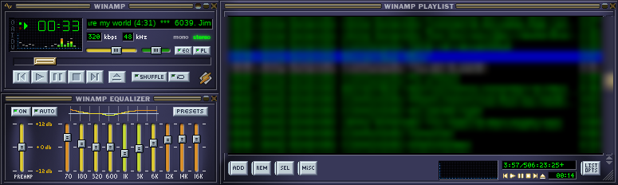

# Winamp on MX Linux

Installs the latest classic Winamp desktop player under Wine, with an
application menu entry and a desktop icon, similar to a normal Windows
install.

*Playlist track names are blurred in the screenshot.*

## Why not the Snap

Snap packages need snapd, which needs systemd running as PID 1. MX Linux
boots SysVinit by default, so the Winamp snap won't run without switching
your boot mode to systemd first (MX's own wiki confirms this, and its
forum has people hitting the same wall on MX 25 KDE). That's a bigger
change than installing a media player calls for, so this goes via Wine
directly instead - no boot mode change needed.

## What it does

1. Installs Wine (and icoutils, for icon extraction) if not already present
2. Creates a dedicated Wine prefix at ~/.wine-winamp, kept separate from
   any other Wine setup you may already have
3. Downloads the current installer from download.winamp.com
4. Runs it silently, with the Windows desktop shortcut and Start Menu
   entry options both switched on
5. Extracts Winamp's icon and builds a proper .desktop launcher, placed
   in both the application menu and on your Desktop

## Usage

    chmod +x winamp.sh
    ./winamp.sh install

Running it with no argument at all also installs - install is the
default. To remove it later:

    ./winamp.sh uninstall

## Known gotcha: silent audio

MX Linux's own wiki flags a sound bug in wine-staging 10.18, the version
MX Package Installer currently pulls in from the Enabled Repos - fixed in
wine-staging 11.5 or wine-legacy 9.21, both in the MX Test Repo. If
Winamp installs and opens fine but plays nothing, that's the first thing
to check: run "wine --version" and compare against what's in the Test
Repo.

## Troubleshooting

### "Jump To File" takes seconds per keypress

Wine's `FindFirstFile` reads the whole directory even when asked for one exact
filename, and Winamp checks every playlist entry as you type. The cost is
linear in how many files sit in the folder your music is in - measured under
Wine 9.21, one enumeration of a folder costs about 0.1 ms per file in it:

    50 files      7 ms
    250 files    27 ms
    1126 files  121 ms

With a few thousand playlist entries pointing into one large folder, that adds
up to seconds per keystroke. Splitting the music into subfolders (by artist, or
even just A-Z) is what fixes it - twenty-five folders of forty files each
enumerate about twenty-five times faster than one folder of a thousand.

Things that are *not* the cause, in case they look like obvious suspects: the
filesystem (an ext4 folder of the same size measured the same as NTFS via
ntfs-3g), and the length of the path (mapping a drive letter straight at the
music folder made no measurable difference).

### Audio stutters when a menu opens

DirectSound output shares badly with the UI thread under Wine, so opening a
menu interrupts the sound. The installer now selects `out_wasapi.dll` instead,
which does not have the problem.

If you still get stutter, the plugin to move to is `out_wave.dll`: it is the
only one of the three with a buffer setting you can raise (Preferences >
Plug-ins > Output > Configure). WASAPI deliberately has no buffer control - the
DLL carries no such setting at all - so there is nothing to turn up there.

### Winamp starts but no window ever appears

    xvidmode.c:164: xf86vm_free_modes: Assertion `modes[0].dmDriverExtra ==
    sizeof(XF86VidModeModeInfo *)' failed.

Wine's X11 driver asserts while enumerating video modes and takes `explorer.exe`
down with it, which leaves `winamp.exe` running with nothing on screen. A media
player has no business changing the screen mode, so the installer turns the
extension off:

    WINEPREFIX=~/.wine-winamp wine reg add "HKCU\Software\Wine\X11 Driver" \
        /v UseXVidMode /t REG_SZ /d N /f

### Visualisation

MilkDrop 2 does not work under Wine's built-in `d3dx9`, whichever way you point
it. With its pixel shaders on it cannot compile them:

    error compiling ps_2.0 warp shader: syntax error, unexpected KW_sampler_state

and with `MaxPSVersion=0` under `[settings]` in `Plugins/Milkdrop2/milk2.ini` it
stops erroring but never draws anything - you get whatever was on the desktop
behind its window - and then puts up "plug-in executed an illegal operation".

So the installer selects **AVS** instead, which Winamp ships in the same folder
and which needs no shaders. Tested here: it opens, renders, and animates.

MilkDrop is still installed if you want to chase it. The fix is Microsoft's own
d3dx9 in place of Wine's:

    WINEPREFIX=~/.wine-winamp winetricks d3dx9

then set `visplugin_name=vis_milk2.dll` back in `winamp.ini`. That pulls
redistributable DLLs from Microsoft, so whether you want them is your call.

## Notes

- The classic desktop installer is no longer easy to find by clicking
  around winamp.com - the site itself has pivoted to a mobile app and
  "Winamp For Artists" business, and the desktop download only exists
  now as this stable, unlisted URL. If it ever stops resolving, the
  script will tell you rather than failing silently (it checks the
  download is actually a Windows executable before handing it to Wine).
- The installer is unsigned freeware from Winamp's own domain, not a
  third-party mirror - no adware bundling, unlike sites such as Softonic.
